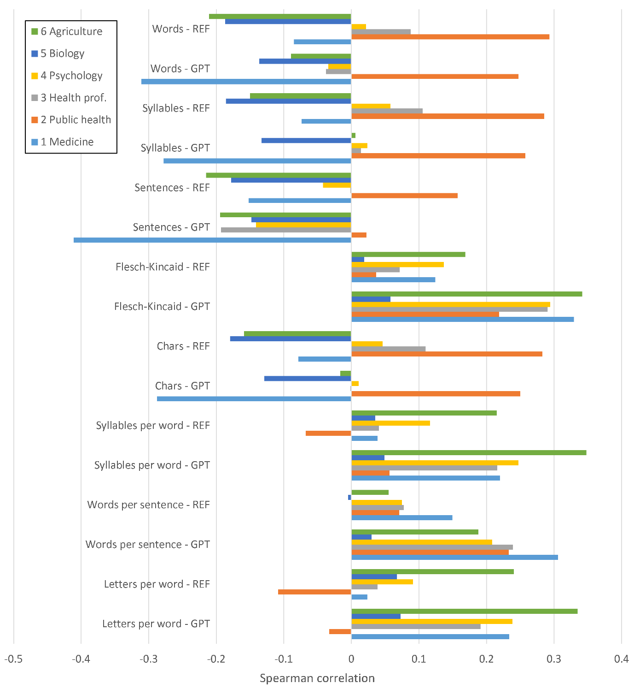
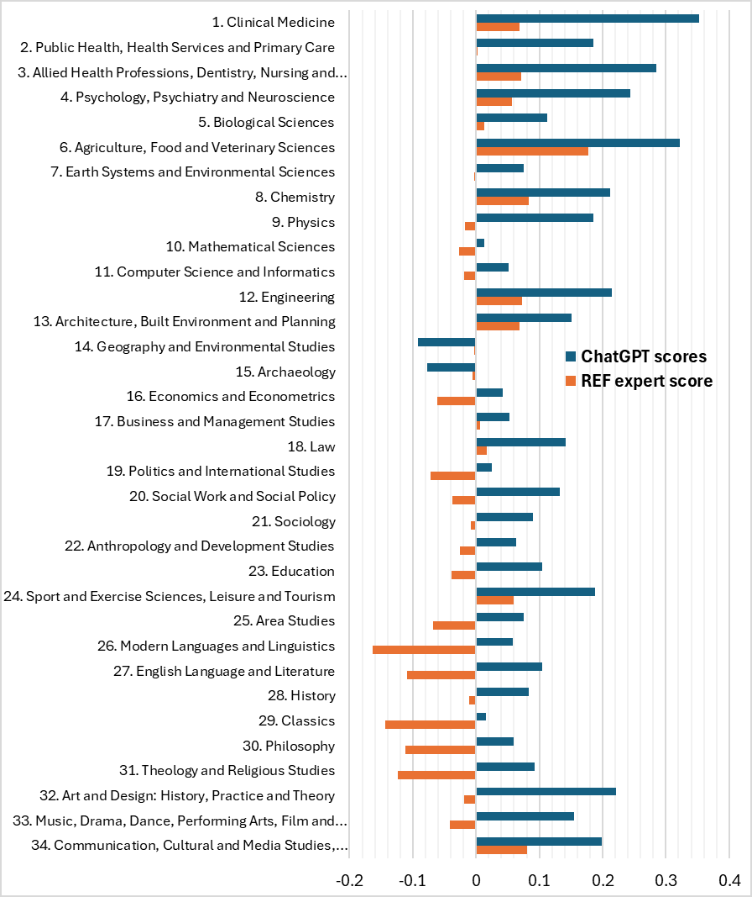

# 논문 리뷰: Which stylistic features fool ChatGPT research evaluations?

> **원제**: Which stylistic features fool ChatGPT research evaluations?
> **저자**: Kayvan Kousha, Mike Thelwall
> **날짜**: 2026-03-16
> **DOI/arXiv**: arXiv:2603.14919
> **리뷰 모드**: PDF

---

## 1. 핵심 요약

ChatGPT를 비롯한 LLM이 연구 품질 평가 도구로 부상하고 있으나, 평가 점수가 실질적 연구 품질이 아닌 초록의 언어적 스타일에 의해 편향될 수 있다는 의문에서 출발한 연구다. 저자들은 UK REF2021 데이터셋(99,277편)을 기반으로 초록의 가독성 지표(Flesch-Kincaid Grade Level, 단어 수, 문장당 단어 수, 음절 수 등)와 ChatGPT 점수 및 인간 전문가(REF) 점수 간의 Spearman 상관관계를 비교 분석했다. 핵심 결과는 ChatGPT 점수가 언어적 복잡도(긴 문장, 복잡한 어휘)와 유의미하게 더 강한 양의 상관관계를 보인 반면, REF 전문가 점수는 그런 상관관계가 훨씬 약하거나 오히려 음의 상관관계를 보인다는 것이다. 이는 ChatGPT가 연구의 내재적 품질보다 언어적 화려함에 더 민감하게 반응할 수 있음을 시사한다. 이 편향은 STEM 및 보건·생명과학 분야에서 특히 두드러졌으며, 인문·사회과학 분야에서도 유사한 패턴이 관찰되었다. 저자들은 이 결과가 LLM이 복잡한 문체를 고품질 연구의 신호로 잘못 학습했을 가능성을 시사하며, 향후 LLM 기반 연구 평가 시스템의 조작 위험성과 개선 방향을 논의한다.

---

## 2. 기술적 분석

### 2-1. 문제 정의 및 동기

LLM은 논문 제목과 초록만으로도 REF 전문가 점수와 중간 수준의 상관관계를 보이는 연구 품질 추정치를 제공할 수 있다고 알려져 있다. 그런데 역설적으로 전문 번역문보다 제목+초록만 입력했을 때 상관관계가 더 높다는 선행 연구가 존재한다. 이는 LLM이 연구 내용 자체보다 초록의 표면적 특성(언어 스타일, 길이)에 의존할 수 있다는 의심을 낳는다. 본 연구는 이를 정량적으로 검증하기 위해, 언어적 복잡도 지표와 LLM 점수 간의 상관관계가 전문가 점수와 비교해 더 강한지를 직접 측정했다.

### 2-2. 방법론

- **데이터셋**: UK REF2021 제출 논문 99,277편 (34개 UoA 분야). 개별 점수는 UoA 1-6(보건·생명과학)의 500편 표본에서만 직접 이용 가능하며, 나머지는 부서 평균 점수를 프록시로 사용.
- **LLM 점수**: ChatGPT-4o, 4o-mini, o1-mini의 5회 반복 평균값 조합.
- **언어 지표**: textstat 라이브러리로 산출한 Flesch Reading Ease, Flesch-Kincaid Grade Level, Gunning Fog, SMOG, ARI, 단어 수, 문장당 단어 수, 음절/단어.
- **분석**: Spearman 순위 상관계수 + 부트스트랩 95% 신뢰구간. 인과관계 검증 없이 상관분석에 한정.
- **비교군**: ChatGPT 점수 vs. REF 전문가 점수 vs. 인용 기반 지표(NLCS).

### 2-3. 결과 해석

- **Flesch-Kincaid Grade Level**: 34개 UoA 중 23개에서 ChatGPT 점수와 유의한 양의 상관. REF 전문가는 9개만 양의 상관, 6개는 오히려 음의 상관(인문학 분야).
- **문장당 단어 수**: STEM·의학 분야에서 ChatGPT 상관이 REF보다 일관되게 높음. 인문학에서는 REF가 음의 상관(짧은 문장 선호).
- **음절/단어**: 28개 UoA에서 ChatGPT와 유의한 양의 상관. REF는 11개만 유의.
- **초록 길이**: 22개 UoA에서 ChatGPT와 양의 상관, 7개는 음의 상관(의학 분야 구조화 초록의 특성). REF는 15개 UoA에서 유의하며 대부분 음의 상관(12개).
- **인용 지표 비교**: NLCS는 언어 복잡도와 약하거나 음의 상관 → LLM이 인용 기반 지표보다도 문체에 더 민감함을 확인.

---

## 3. 비판적 분석

### 강점

1. **대규모·다분야 데이터**: REF2021의 99,277편을 34개 분야에 걸쳐 분석함으로써 분야별 편향 패턴을 체계적으로 비교할 수 있었다. 단일 분야 연구에서는 포착하기 어려운 분야 간 이질성을 명확히 드러낸다.
2. **이중 비교 설계**: LLM 점수와 인간 전문가 점수를 동시에 같은 지표와 비교함으로써, 관찰된 상관이 언어 복잡도가 실제 품질과 연관되어서가 아니라 LLM 특유의 편향임을 설득력 있게 보여준다.
3. **다중 지표 교차 검증**: Flesch-Kincaid, Gunning Fog, SMOG 등 여러 가독성 지표에서 일관된 패턴이 재현되어 결과의 강건성을 높였다.
4. **실용적 함의 제시**: 결과를 단순 보고에 그치지 않고, LLM 평가 시스템에서 언어 스타일 편향을 줄이기 위한 프롬프트 설계 및 훈련 방향에 대한 제언까지 이어진다.

### 약점

1. **인과관계 불명확**: 상관분석만으로는 언어 복잡도가 ChatGPT 점수를 올리는지, 아니면 제3의 요인(예: 특정 연구 방법론, 분야 관행)이 둘 모두에 영향을 미치는지 구분할 수 없다. 저자들도 이를 명시적으로 인정하지만, 정책 함의를 논의할 때는 인과적 추론에 가까운 언어를 사용한다.
2. **REF 점수 프록시의 한계**: 대부분의 분야에서 개별 논문 점수가 없어 부서 평균을 프록시로 사용했다. 이는 REF 쪽 상관계수를 과소추정하여 ChatGPT와의 차이를 인위적으로 크게 보일 수 있다. 직접 비교 가능한 UoA 1-6에서도 이 효과의 크기를 완전히 정량화하지 않았다.
3. **단일 언어·단일 국가 데이터**: 영국 REF2021 데이터만 사용하여 영어 비원어민 국가나 다른 평가 체계에서도 동일한 편향이 나타나는지 일반화하기 어렵다. 비영어권 연구자가 LLM 평가에서 불이익을 받는지 여부는 미검토 상태다.
4. **LLM 범위 제한**: ChatGPT 계열 모델만 분석했으며, Gemini, Claude, LLaMA 등 다른 LLM에서 동일한 편향이 재현되는지 검증되지 않았다.

---

## 4. 종합 평가

| 항목 | 점수 (1-5) | 근거 |
|------|-----------|------|
| Novelty | 4 | LLM 연구 평가의 언어 스타일 편향을 대규모로 체계적으로 정량화한 최초 시도 수준. 단, 편향 존재 자체는 예측 가능했음 |
| Technical Soundness | 3 | Spearman 상관 + 부트스트랩 CI는 적절하나, 인과 식별 전략 부재와 프록시 점수의 한계가 신뢰도를 제한 |
| Practical Impact | 4 | LLM 기반 연구 평가 도입을 검토하는 기관·정책 입안자에게 직접적인 경고 메시지 제공. 조작 위험성 논의가 시의적절 |
| Overall | 4 | 중요한 문제를 적절한 데이터로 탐구한 실용적 기여. 인과 분석과 다국어·다모델 확장이 후속 과제 |

**총평**: 대규모 REF 데이터를 활용해 ChatGPT가 언어적 복잡도에 전문가보다 과도하게 민감하다는 것을 다분야에 걸쳐 설득력 있게 보여준 시의성 높은 연구이나, 상관분석에 머문 한계와 프록시 점수 사용의 잠재적 편향을 감안해야 한다.
