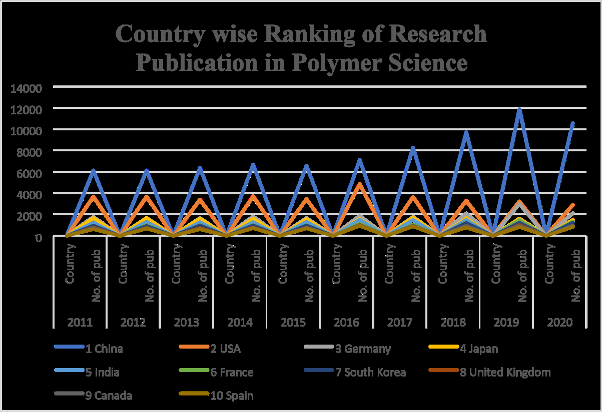

# 논문 리뷰: Polymer Science Research in India: A Scientometrics Study
> **저자**: Kranti V. Mete, Sanjay Wagh | **날짜**: 2026-03-09 | **DOI**: 10.26761/IJRLS.12.1.2026.2043
> **리뷰 모드**: PDF
---

## 1. 핵심 요약

인도의 고분자과학(Polymer Science) 연구 생산성을 Web of Science 데이터를 기반으로 계량서지학적(scientometrics)으로 분석한 연구다. 2010~2020년 기간 중 인도의 고분자과학 분야 총 논문 수는 25,044편이며, 중국에 이어 세계 2위로 부상했음을 보인다. 상대성장률(RGR)과 배증기간(DT) 지표를 활용해 성장 궤도를 분석하고, 주제별·기관별 연구 생산성도 함께 제시한다.

---

## 2. 기술적 분석 (방법론 + 결과)

### 데이터 수집
- **데이터베이스**: Web of Science
- **분석 기간**: 2000~2019년 (범위 언급) / 실제 표 데이터는 2010~2020년 (불일치)
- **소프트웨어**: Biblioshyne (계량서지 분석 도구)

### 주요 지표

**국가별 논문 수 순위 (2010~2020)**

| 순위 | 2010 | 2020 |
|------|------|------|
| 1 | 중국 (5,563) | 중국 (10,544) |
| 2 | 미국 (3,734) | 인도 (3,075) |
| 3 | 독일 (1,663) | 미국 (2,891) |
| **4** | **인도 (1,580)** | — |

인도는 2010년 4위에서 2020년 2위로 상승하며 독일·미국을 추월.

**상대성장률(RGR) 및 배증기간(DT)**

- RGR 공식: `RGR = ln(W2) - ln(W1)` (누적 논문 수 기준)
- 최고 RGR: **13.49** (2014년), 2013년 11.68로 뒤를 이음
- 2015년 이후 RGR 감소 → 성숙 단계 진입

*Fig. 1: 인도 고분자과학 논문의 연도별 상대성장률(RGR) 및 배증기간(DT)*

**주제별 분포 (상위 5개)**

| 순위 | 주제 | 논문 수 | 비율 |
|------|------|--------|------|
| 1 | Composite material | 4,718 | 20.81% |
| 2 | Materials science | 4,629 | 20.42% |
| 3 | Polymer | 1,106 | 4.88% |
| 4 | Composite number | 991 | 4.37% |
| 5 | Nanocomposite | 981 | 4.33% |

**기관별 상위 5개**

| 순위 | 기관 | 논문 수 | 비율 |
|------|------|--------|------|
| 1 | IIT Delhi | 269 | 12.44% |
| 2 | IIT Kharagpur | 250 | 11.56% |
| 3 | IISc | 207 | 9.57% |
| 4 | CSIR | 204 | 9.44% |
| 5 | Mahatma Gandhi Univ. | 194 | 8.97% |

---

## 3. 비판적 분석

### 강점

1. **실용적 정책 기여**: 인도의 고분자과학 연구 생산성을 글로벌 맥락에서 정량화함으로써 연구 정책·기관 평가에 활용 가능한 기초 데이터를 제공한다.
2. **다층적 분석 구조**: 국가별 → 연도별 → 주제별 → 기관별로 다단계 계량서지 분석을 수행해 인도 연구 생태계의 전반적 구조를 파악할 수 있다.
3. **표준 계량지표 적용**: RGR·DT라는 검증된 계량서지 지표를 사용하여 성장 단계(출현 → 팽창 → 성숙)를 체계적으로 설명한다.

### 약점

1. **데이터 기간 불일치**: 연구 범위에서는 "2000~2019년"을 명시하나, 실제 분석 표(Table 1, 2)는 2010~2020년 데이터를 사용한다. 이 모순은 논문의 신뢰성을 크게 훼손한다.
2. **인용·영향력 지표 부재**: 논문 수(양적 생산성)만 측정하고, 피인용 수·h-index·JIF 등 질적 지표가 전혀 분석되지 않아 연구 영향력을 평가할 수 없다.
3. **방법론적 세부 정보 결여**: 검색 쿼리, 필터링 기준, 중복 제거 방식 등 데이터 수집 프로토콜이 기술되지 않아 재현성(reproducibility)이 낮다.
4. **주제 분류 오류**: Table 3의 주제 목록에 "Composite number"(수학 용어)가 포함되어 있는데, 이는 "Composite material"의 중복 집계 혹은 WoS 키워드 처리 오류일 가능성이 높으나 설명이 없다.
5. **국제 협력 분석 미흡**: 인도의 국제 공동연구 네트워크 분석이 부재하여 연구 생태계의 개방성 및 글로벌 연결성을 평가할 수 없다.

---

## 4. 종합 평가

| 항목 | 점수 (5점) | 비고 |
|------|-----------|------|
| 연구 목적 명확성 | 3 | 목표는 명확하나 범위 불일치 |
| 방법론 엄밀성 | 2 | 재현 불가, 기간 오류 |
| 결과 신뢰성 | 2 | 질적 지표 없음, 분류 오류 |
| 기여도 | 3 | 인도 고분자과학 현황 파악에 유용 |
| 서술 완성도 | 2 | 그림 참조 누락, 논의 부족 |
| **종합** | **2.4 / 5** | |

**총평**: 인도의 고분자과학 연구 생산성을 계량서지학적으로 개관하는 의도는 타당하나, 데이터 기간 불일치·방법론 불투명·질적 지표 부재라는 근본적 결함이 있다. 저널지 수준의 스크리닝을 통과하기 위해서는 데이터 정합성 수정, 인용 분석 추가, 검색 프로토콜 상세 기술이 반드시 필요하다. 현 상태는 예비 보고서(preliminary report)에 가깝다.
