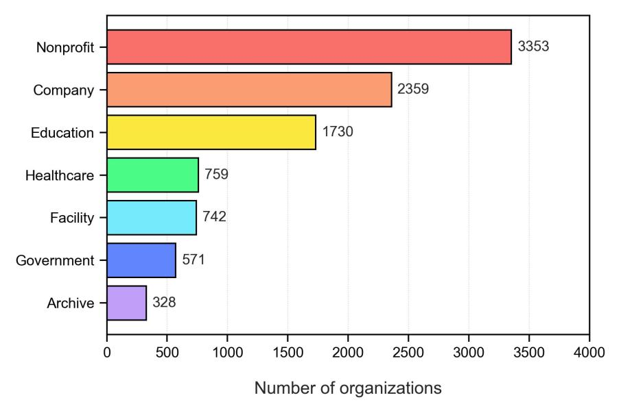

# 논문 리뷰: Organisational accounts engaged in scholarly communication on Twitter

> **저자**: Zohreh Zahedi, Yanqing Zhang, Zekun Han, Er-Te Zheng, Zhichao Fang | **날짜**: 2026-03-17 | **arXiv**: 2603.16637
> **리뷰 모드**: PDF

---

## 1. 핵심 요약

Twitter(현 X)에서 학술 출판물을 트윗한 **기관 계정**을 대규모로 식별·분석한 연구다. GRID, ROR, Overton 세 개의 기관 데이터베이스(총 111,280개 기관)를 Altmetric과 Crossref Event Data(CED)의 altmetric 데이터(1억 5천만 건 이상의 학술 트윗)와 연결하여, 학술 커뮤니케이션에 참여한 **9,842개 기관 Twitter 계정**을 식별하고 공개 데이터셋으로 공개했다.

분석은 세 차원으로 구성된다: (1) **소셜 미디어 자본** (팔로워/팔로잉 수), (2) **트윗 활동성** (연간 트윗 수, 학술 트윗 비율, 독창성 비율), (3) **참여 수준** (좋아요, 리트윗, 인용, 답글). 기관 계정은 일반 사용자 대비 팔로워 기반이 강하고 학술 트윗 비중이 높지만, 대화형 참여(인용·답글)에서는 상대적으로 취약하다. 기관 유형별로는 **연구시설(Facility)**이 학술 트윗 집중도가 가장 높고, **정부 기관(Government)**이 모든 참여 지표에서 가장 우수한 성과를 보인다.

---

## 2. 기술적 분석

### 데이터 구축

| 소스 | 규모 | 역할 |
|---|---|---|
| GRID (2021) | 106,149개 기관 | 기관 식별자 |
| ROR (2024) | 138,546개 기관 | 기관 유형 분류 |
| Overton (2024) | 2,244개 정책기관 | 정부·싱크탱크 보완 |
| Altmetric (2022) | 175,852,041 트윗 ID | 학술 트윗 소스 |
| Crossref Event Data (2023) | 75,286,156 트윗 ID | 학술 트윗 소스 |
| 최종 학술 트윗 DB | **150,586,368건** / **10,119,331 계정** | 분석 모집단 |

### 매칭 방법론

기관명(풀네임·별칭)과 Twitter 프로필 정보를 기반으로 후보 쌍을 생성하고, 기관 주소·트위터 계정의 자기보고 위치·공식 웹사이트의 Twitter 링크를 활용한 **수동 검증**으로 최종 9,842개 계정을 확정했다. 매칭률은 약 8.8% (9,842/111,280).

### 분석 지표

모든 지표는 전체 10,119,331개 계정 대비 **백분위 순위**로 변환하여 비교. 절댓값의 분포 편향 문제를 백분위 변환으로 완화한 점이 방법론적으로 타당하다.

### 주요 결과 요약

- **기관 분포**: 비영리(3,353) > 기업(2,359) > 교육(1,730) > 시설(938) > 정부(786) > 의료(661) > 아카이브(215)
- **소셜 미디어 자본**: 기관 계정 대다수가 팔로워 상위 10% (백분위 중앙값 ~0.85)
- **트윗 활동성**: 전체 트윗 활동은 중앙값 0.50으로 평범하나, 학술 트윗 집중도(scholarly focus rate) 중앙값은 0.6 이상
- **참여 수준**: 좋아요(0.79), 리트윗(0.86) 백분위 높음 vs. 인용·답글은 하위권 집중
- **유형별 차이**: 연구시설 = 최고 학술 집중도, 정부 = 전 지표 최고 참여도

---

## 3. 비판적 분석

### 강점

1. **공개 데이터셋 기여**: 9,842개 기관 Twitter 계정 데이터를 Figshare에 공개(DOI: 10.6084/m9.figshare.31321240). 향후 altmetrics·과학사회학 연구의 재사용 가능한 인프라를 구축했다.

2. **방법론적 재현성과 확장성**: GRID+ROR+Overton 통합 후 altmetric DB와의 매칭이라는 파이프라인이 명확히 기술되어 있어, Bluesky·Mastodon 등 신흥 플랫폼으로 확장 가능한 프레임워크를 제시한다.

3. **대규모 비교 기반 분석**: 단순 기관 프로파일링에 그치지 않고, 전체 10,119,331개 학술 트윗 계정 대비 백분위 순위를 계산함으로써 기관 계정의 상대적 위치를 정량적으로 평가했다. 이는 altmetrics 분야의 "2세대 지표" 논의(Díaz-Faes et al., 2019)와 일치하는 접근이다.

4. **7개 기관 유형별 세분화**: 단순 "기관 vs. 개인" 이분법을 넘어 비영리, 기업, 교육, 의료, 시설, 정부, 아카이브로 세분화하여 유형 간 이질성을 드러냈다.

### 약점

1. **수동 검증의 확장성 한계**: 최종 확정 과정에서 수동 검증에 의존함으로써 재현성이 제한된다. 검증자 간 일치도(inter-rater agreement) 등의 신뢰도 지표가 보고되지 않아 검증 품질을 평가하기 어렵다.

2. **데이터 시간 범위의 불균형**: Altmetric 스냅샷(2022년 11월)과 CED 스냅샷(2023년 1월) 사이의 시간적 불일치, 그리고 Twitter API 데이터 수집 시점(2023년 3월)이 맞물리면서 삭제된 트윗에 의한 **생존 편향(survivorship bias)**이 있다. 이는 논문에서 언급되나 영향의 크기는 정량화되지 않는다.

3. **인과성 부재**: 정부 계정의 높은 대화형 참여가 콘텐츠 전략의 차이인지, 대형 팔로워 기반의 규모 효과인지, 또는 주제(정책 관련 학술 콘텐츠)의 속성인지 구분하지 못한다. 회귀분석 등 통제 분석이 없다.

4. **콘텐츠 분석 부재**: 트윗의 텍스트·해시태그·멘션 네트워크 등 질적 분석이 없어, 왜 특정 기관 유형이 더 많은 대화형 참여를 유도하는지에 대한 기제(mechanism)를 설명하지 못한다.

5. **플랫폼 단일성**: Twitter/X 하나의 플랫폼에 국한되어 있어, LinkedIn·ResearchGate·Bluesky 등 다른 플랫폼에서의 기관 활동을 포괄하지 못한다. 특히 2022~2023년 이후 Twitter 생태계의 변화(유료 API, 이용자 이탈)를 고려할 때 결과의 현재 대표성이 제한적이다.

---

## 4. 종합 평가

| 평가 항목 | 점수 | 비고 |
|---|---|---|
| 연구 기여도 | ★★★★☆ | 최초 대규모 기관 계정 공개 데이터셋 |
| 방법론 엄밀성 | ★★★☆☆ | 백분위 분석 타당, 수동 검증 신뢰도 미보고 |
| 분석 깊이 | ★★★☆☆ | 기술통계 중심, 인과 분석 부재 |
| 재현성·확장성 | ★★★★☆ | 명확한 파이프라인, 공개 데이터 |
| 현재적 관련성 | ★★★☆☆ | 데이터가 2022~2023년 기준, Twitter 생태계 변화 반영 못함 |
| **종합** | **★★★☆☆** | |

**총평**: 이 연구는 altmetrics 분야에서 개인 사용자 중심의 분석을 넘어 **기관 행위자(institutional actors)**를 체계적으로 다룬 선구적 작업이다. 공개 데이터셋과 재현 가능한 매칭 파이프라인은 후속 연구를 위한 실질적 기여다. 다만 분석이 기술적 수준에 머물고, 대화형 참여의 낮음·높음을 설명하는 기제 탐색이 없으며, 수동 검증의 신뢰도 문제가 아쉽다. Twitter 플랫폼 자체의 급변하는 환경을 감안하면, 본 연구의 결과는 2022~2023년 시점의 스냅샷으로 해석되어야 하며 현재성에 대한 추가 검증이 필요하다.
